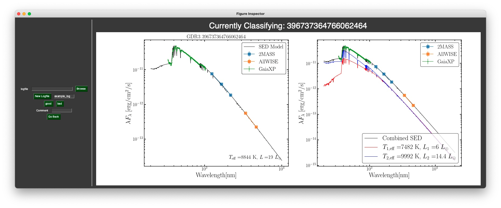

# FigureInspector

Tool to quickly scan through image files and write to a log

Basic example
```
from figure_inspector import inspector
inspector.classify('data', buttons=['good', 'bad'])
```

This will open up a window:


Enter a name for the output logfile, or click browse to keep going from an existing log. This will start the classification process:


Clicking the desired button to classify the image, and optionally add a comment. If you'd like to go back, hit 'Go Back' to return to the previous figure and re-classify. 

Exiting the window will save the log. 

There are some issues with figure re-sizing... YMMV
